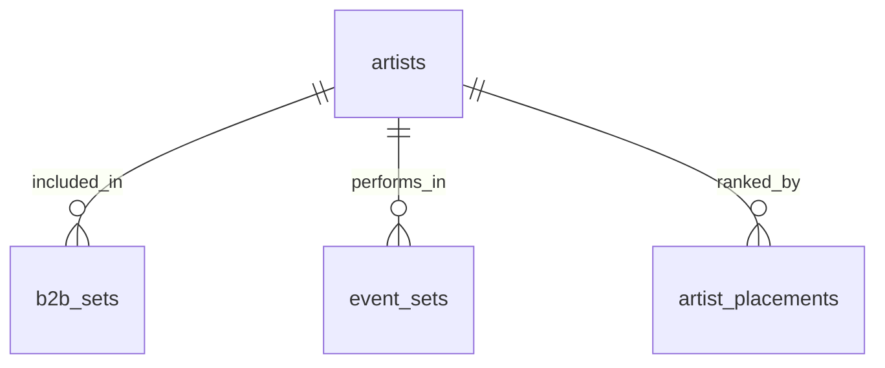
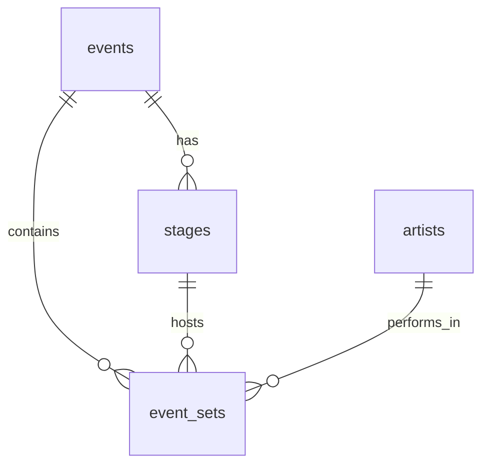
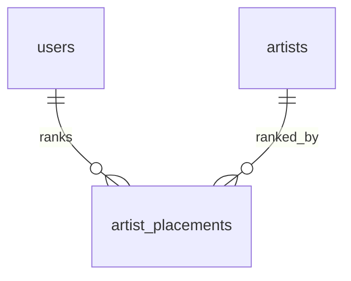
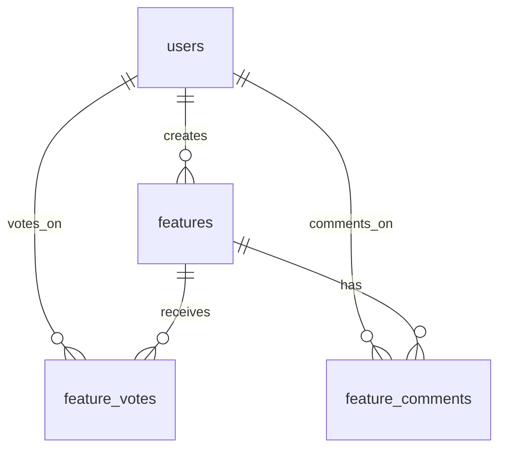

# Database Relationships

## Core Relationships

### Artists and Placements
- `artists` ⟷ `artist_placements`: One-to-many relationship
  - An artist can have multiple placements
  - Each placement belongs to one artist
  - Exposed through `artist_placements_with_names` view

### Events and Sets
- `events` ⟷ `event_sets`: One-to-many relationship
  - An event can have multiple sets
  - Each set belongs to one event
  - Sets can be regular or B2B sets

### Sets and Artists
- `event_sets` ⟷ `event_set_artists` ⟷ `artists`: Many-to-many relationship
  - An event set can have multiple artists (especially for B2B sets)
  - An artist can be part of multiple event sets
  - Exposed through `event_sets_view`

### Users and Roles
- `users` ⟷ `roles`: One-to-many relationship
  - A user can have multiple roles
  - Default 'fan' role assigned on user creation
  - Managed through `handle_new_user_role` trigger
  - Role checks via `has_role()` function

### Feature Voting
- `features` ⟷ `feature_votes` ⟷ `users`: Many-to-many relationship
  - Users can vote on multiple features
  - Features can receive votes from multiple users
  - Managed through `get_feature_votes()` function

## Special Handling

### B2B Sets
B2B (back-to-back) sets have special handling:
- Fingerprint generation for unique identification
- Managed through multiple functions:
  - `sorted_artist_fingerprint()`
  - `generate_b2b_fingerprint()`
  - `set_b2b_fingerprint()` trigger

### Timestamp Management
- Tables with `updated_at` columns are automatically managed
- Uses `update_updated_at_column()` trigger function
- Currently implemented on:
  - `artist_placements` table

## Entity Relationships

### Artist Management

- **artists → b2b_sets**: One-to-many relationship where artists can be part of multiple B2B sets
  - Constraint: `artist_ids` array in `b2b_sets` must contain valid artist IDs
  - Deletion: Artists cannot be deleted if they are part of any B2B sets

### Event Management

- **events → stages**: One-to-many relationship where events can have multiple stages
  - Constraint: `event_id` in `stages` references `events(id)`
  - Deletion: Cascade delete stages when event is deleted

- **events → event_sets**: One-to-many relationship where events contain multiple sets
  - Constraint: `event_id` in `event_sets` references `events(id)`
  - Deletion: Cascade delete event sets when event is deleted

- **stages → event_sets**: One-to-many relationship where stages host multiple sets
  - Constraint: `stage_id` in `event_sets` references `stages(id)`
  - Deletion: Set `stage_id` to null in event sets when stage is deleted

### User Rankings

- **users → artist_placements**: One-to-many relationship where users can rank multiple artists
  - Constraint: `user_id` in `artist_placements` references `auth.users(id)`
  - Constraint: Composite primary key (user_id, artist_id) ensures one ranking per user per artist
  - Deletion: Delete rankings when user is deleted

### Feature Voting

- **users → features**: One-to-many relationship where users can create multiple features
  - Constraint: `created_by` in `features` references `auth.users(id)`
  - Deletion: Preserve features when user is deleted

- **users → feature_votes**: One-to-many relationship where users can vote on multiple features
  - Constraint: `user_id` in `feature_votes` references `auth.users(id)`
  - Constraint: Composite primary key (user_id, feature_id) ensures one vote per user per feature
  - Deletion: Delete votes when user is deleted

- **users → feature_comments**: One-to-many relationship where users can comment on multiple features
  - Constraint: `user_id` in `feature_comments` references `auth.users(id)`
  - Deletion: Delete comments when user is deleted

- **features → feature_votes**: One-to-many relationship where features receive multiple votes
  - Constraint: `feature_id` in `feature_votes` references `features(id)`
  - Deletion: Cascade delete votes when feature is deleted

- **features → feature_comments**: One-to-many relationship where features have multiple comments
  - Constraint: `feature_id` in `feature_comments` references `features(id)`
  - Deletion: Cascade delete comments when feature is deleted

## Row Level Security (RLS) Policies

### Artist Management
- `artists`: Public read access, admin-only write access
- `b2b_sets`: Public read access, admin-only write access

### Event Management
- `events`: Public read access, admin-only write access
- `stages`: Public read access, admin-only write access
- `event_sets`: Public read access, admin-only write access

### User Rankings
- `artist_placements`: 
  - Read: User can read their own rankings and aggregated public data
  - Write: User can only modify their own rankings

### Feature Voting
- `features`: 
  - Read: Public read access
  - Write: Authenticated users can create, admin can update status

- `feature_votes`:
  - Read: Public read access for vote counts
  - Write: Authenticated users can vote once per feature

- `feature_comments`:
  - Read: Public read access
  - Write: Authenticated users can create and edit their own comments 